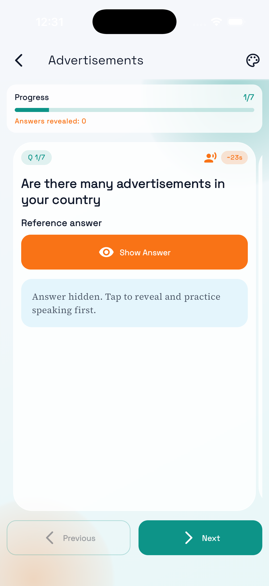
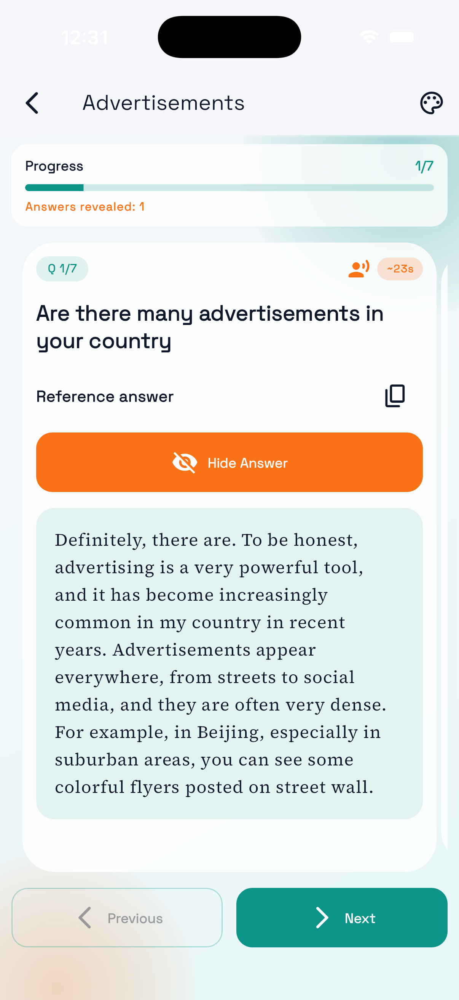
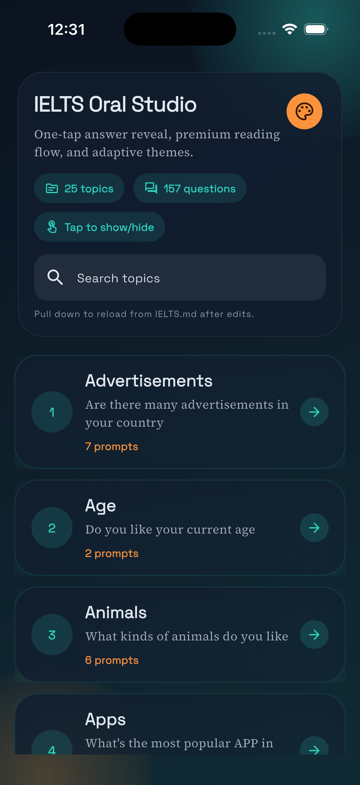
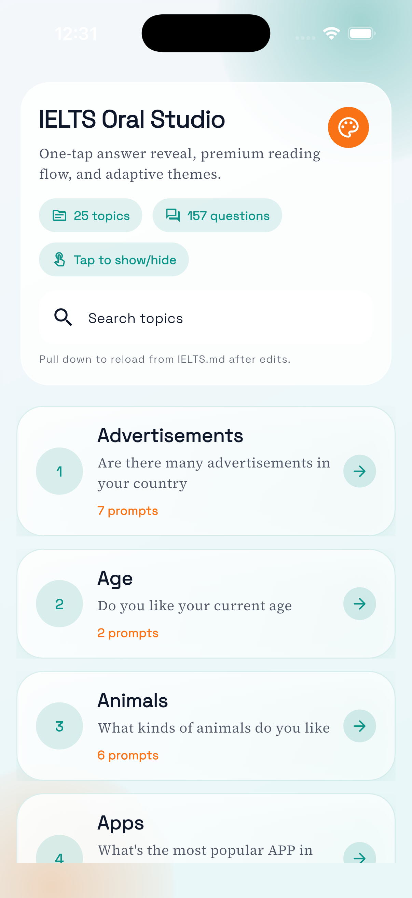

# IELTS Oral Reviser

A Flutter mobile app for IELTS speaking revision with:

- topic browsing from `IELTS.md`
- one-tap answer show/hide
- light and dark theme
- customizable font size

## UI Preview

### Main Page (Dark Mode)



### Main Page (Light Mode)



### Question Page



### Answer Page



## Run

```bash
flutter pub get
flutter run
```
